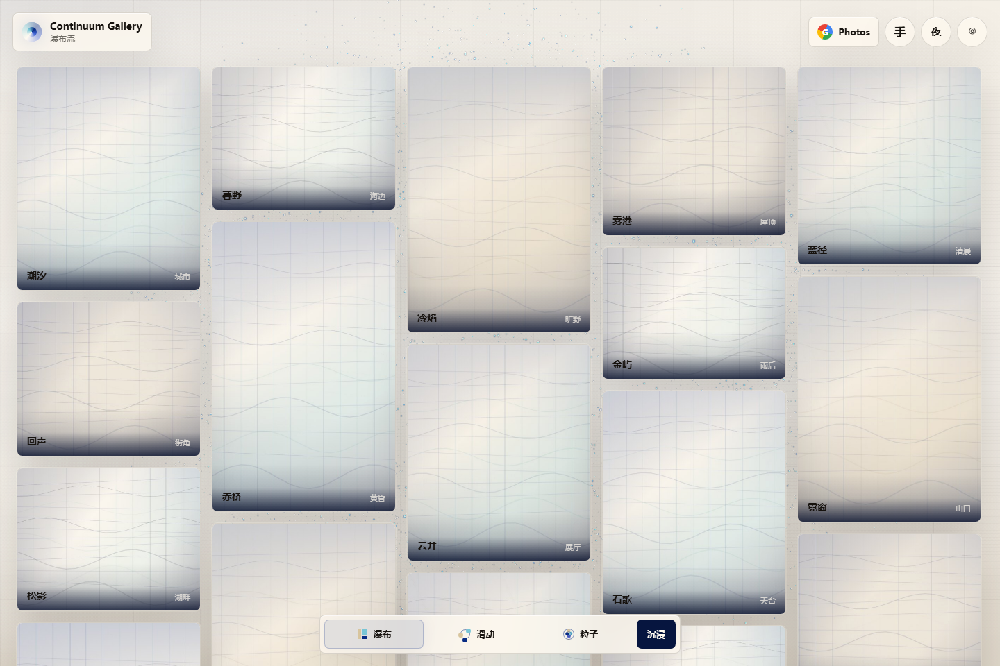
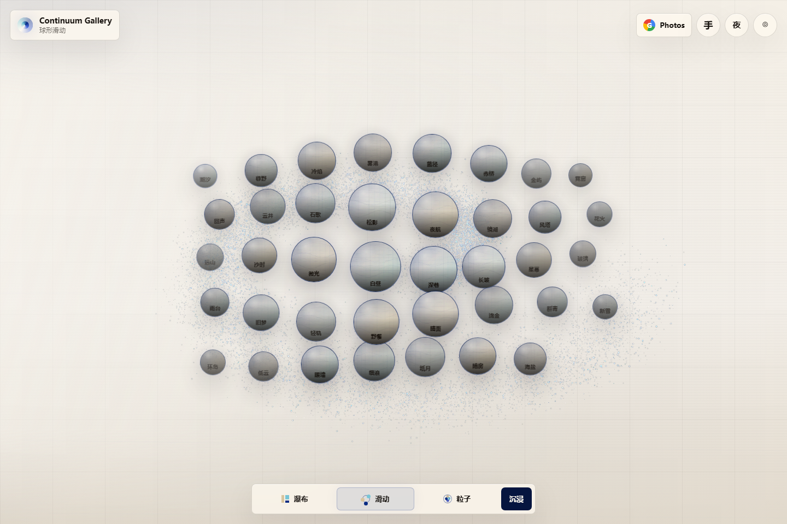
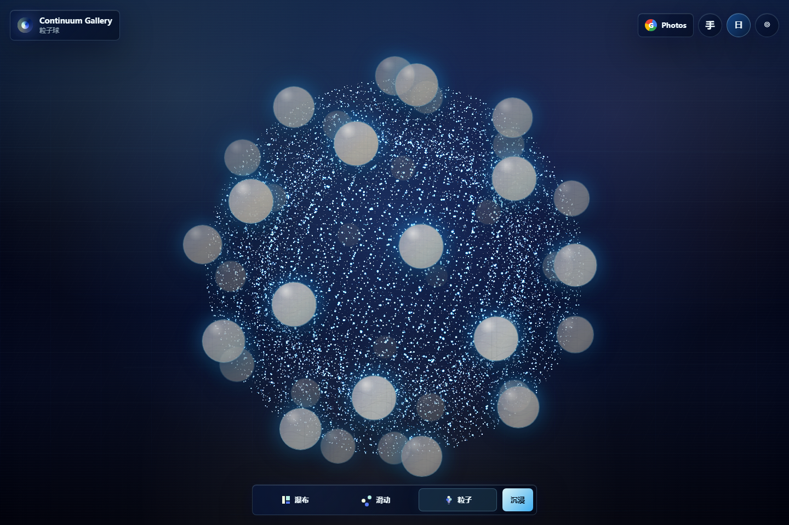

<div align="center">

# Continuum Gallery

An immersive static photo gallery where images become a living particle space.

[简体中文](README.md) · [English](README.en.md)

[Open Gallery](https://uuuuytgg.github.io/continuum-gallery/) ·
[Promo Page](https://uuuuytgg.github.io/continuum-gallery/promo.html) ·
[Changelog](CHANGELOG.md)

<br>


</div>

## What It Is

Continuum Gallery is a static immersive photo gallery built for GitHub Pages. It keeps the browsing efficiency of a regular gallery, then extends it with spherical sliding, a luminous particle-sphere mode, day and night themes, Google Photos import, local preview caching, and optional hand-gesture control.

The promo page is the release and visual showcase. The Gallery is the actual product experience. Both share the same screenshots, visual system, and release notes.

## Links

| Link | Purpose |
| --- | --- |
| [Open Gallery](https://uuuuytgg.github.io/continuum-gallery/) | Try the gallery, modes, themes, and gesture entry point |
| [Open Promo Page](https://uuuuytgg.github.io/continuum-gallery/promo.html) | View the visual direction and release story |
| [Read Changelog](CHANGELOG.md) | Review release changes, fixes, and verification notes |
| [简体中文 README](README.md) | Default Chinese project homepage |

## Preview

<table>
  <tr>
    <td width="50%">
      
      <br>
      <sub>Waterfall: fast full-gallery browsing.</sub>
    </td>
    <td width="50%">
      
      <br>
      <sub>Spherical slide: photo bubbles move with one shared particle field.</sub>
    </td>
  </tr>
  <tr>
    <td width="50%">
      
      <br>
      <sub>Day particle sphere: warm paper and Klein-blue particles.</sub>
    </td>
    <td width="50%">
      
      <br>
      <sub>Night particle sphere: the original deep-blue sci-fi field.</sub>
    </td>
  </tr>
</table>

## Highlights

| Capability | Details |
| --- | --- |
| Three viewing states | Waterfall, spherical slide, and particle sphere |
| WebGL particles | Mode transitions, drag wakes, and sphere aggregation are driven by the particle system |
| Day and night themes | Warm paper by day, locked deep-blue sci-fi by night |
| Google Photos Picker | Browser-side read-only photo selection |
| Local preview cache | Imported previews can be cached with IndexedDB |
| Optional gestures | MediaPipe Hands supports V sign, thumb gesture, and fist drag |
| Static deployment | HTML, CSS, and JavaScript only; no build step or backend required |

## Modes

| Mode | Experience |
| --- | --- |
| Waterfall | A traditional gallery surface for fast scanning and single-photo viewing |
| Spherical Slide | Circular previews float above one shared particle field that reacts to drag momentum |
| Particle Sphere | Photos orbit a luminous blue-white particle body |

## Controls

| Input | Result |
| --- | --- |
| Bottom mode buttons | Switch between waterfall, spherical slide, and particle sphere |
| Drag | Move the view in spherical slide and particle sphere modes |
| Wheel | Browse horizontally in the sliding mode |
| `Ctrl + wheel` | Switch modes quickly |
| Day / night button | Toggle theme while keeping the current mode |
| Gesture button | Enable or disable browser-side hand tracking |

## Gestures

Gesture recognition runs locally in the browser through MediaPipe Hands. To reduce accidental mode changes, mode switching uses explicit gestures instead of horizontal palm movement.

| Gesture | Action |
| --- | --- |
| `V` sign | Next mode |
| Thumb gesture | Previous mode |
| Fist | Simulated drag |

During mode-switch animations, gesture inference gives more budget back to rendering so particle transitions stay smoother.

## Google Photos Setup

1. Open Google Cloud Console.
2. Enable the Google Photos Picker API.
3. Create an OAuth 2.0 Web Client ID.
4. Add `https://uuuuytgg.github.io` to Authorized JavaScript origins.
5. Open the deployed Gallery.
6. Click `Photos`, enter the Client ID, save it, and choose photos.

Requested scope:

```text
https://www.googleapis.com/auth/photospicker.mediaitems.readonly
```

Imported media is used locally through browser object URLs. When available, preview assets are cached through IndexedDB.

## Local Preview

```bash
python -m http.server 8765
```

Open:

| Page | URL |
| --- | --- |
| Gallery | http://127.0.0.1:8765/ |
| Promo Page | http://127.0.0.1:8765/promo.html |

## Project Files

| Path | Purpose |
| --- | --- |
| `index.html` | Main Gallery entry |
| `styles.css` | Gallery layout, mode styles, and themes |
| `app.js` | Gallery state, particle system, Google Photos, viewer, and gesture control |
| `promo.html` / `promo.css` / `promo.js` | Promo and release-story page |
| `assets/promo/` | Screenshots shared by the README and promo page |
| `CHANGELOG.md` | Release notes, fixes, and verification records |
