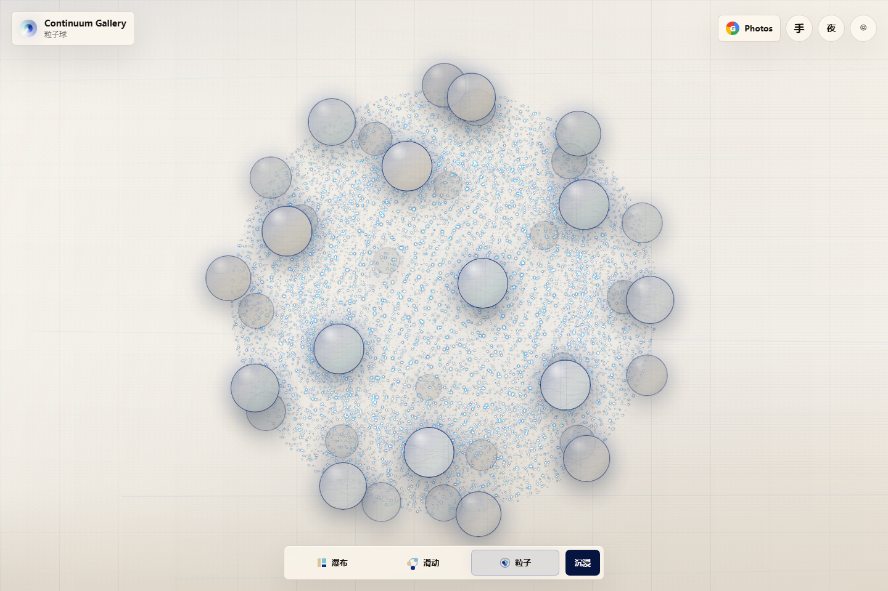

# Continuum Gallery

把照片变成一座会呼吸的粒子圣殿。

[在线体验](https://uuuuytgg.github.io/continuum-gallery/) | [宣传页](https://uuuuytgg.github.io/continuum-gallery/promo.html) | [更新日志](https://github.com/uuuuytgg/continuum-gallery/blob/main/CHANGELOG.md) | [源码仓库](https://github.com/uuuuytgg/continuum-gallery)



## 项目概览

Continuum Gallery 是一个面向 GitHub Pages 的纯静态沉浸式相册。它把瀑布流浏览、球形滑动、粒子球态、Google Photos 导入、手势控制，以及日夜双主题，收束成一个不需要构建流程、不依赖后端服务的开源前端作品。

宣传页不是独立的另一个产品，而是这个项目的发布叙事页面：
它负责展示视觉方向、模式差异和交互气质；真正的产品入口仍然是 Gallery 本体。

## 立即访问

- [Gallery 主体验](https://uuuuytgg.github.io/continuum-gallery/)
- [Promo 宣传页](https://uuuuytgg.github.io/continuum-gallery/promo.html)
- [CHANGELOG](https://github.com/uuuuytgg/continuum-gallery/blob/main/CHANGELOG.md)

## 核心特性

- 三种浏览模式：
  瀑布流、球形滑动、粒子球态
- 日 / 夜双主题：
  日间是暖纸与克莱因蓝，夜间保留原版深蓝科幻场域
- WebGL 粒子系统：
  模式切换、粒子流场、拖拽尾流、球态发光核心
- Google Photos Picker：
  浏览器内选择照片，并使用 IndexedDB 做本地预览缓存
- MediaPipe Hands：
  可选手势交互，支持切换模式与拖拽模拟
- 纯静态部署：
  只有 `HTML + CSS + JavaScript`

## 模式说明

### 1. 瀑布流

用于快速浏览完整图片集，保持相册最基本的秩序感和浏览效率。

### 2. 球形滑动

圆形预览图组成一个可拖拽的空间场。图片球保持滑动浏览的主体地位，背景粒子跟随它们产生延迟、尾流和能量变化，而不是一层廉价贴图。

### 3. 粒子球态

照片漂浮在发光粒子球表面，蓝白粒子组成一个高密度、神圣感更强的数字天体。

## 主题系统

### 日间模式

- 暖纸背景
- 克莱因蓝交互高亮
- 更明显的蓝白粒子显示
- 更适合作为作品展示和开源项目首页视觉

### 夜间模式

- 深蓝黑场背景
- 保留原版科幻视觉方向
- 更像沉浸式装置或演示现场

## 控制方式

- 点击底部模式按钮切换视图
- 在球形滑动和粒子球态中拖拽移动画面
- 在滑动模式下使用滚轮横向浏览
- 使用 `Ctrl + 滚轮` 在模式间快速切换
- 在瀑布流或滑动模式中点击照片打开 Viewer
- 在粒子球态中点击照片会先聚焦回滑动模式
- 点击顶部 `夜 / 日` 按钮切换主题
- 点击顶部手势按钮启用手势交互

## 手势交互

手势识别在浏览器中通过 MediaPipe Hands 运行：

- `V`：
  切换到下一档模式
- `大拇指`：
  返回上一档模式
- `握拳`：
  模拟拖拽

项目里做了稳定帧判断和冷却控制，用来降低误触率，并在模式切换动画期间让出部分预算，减少卡顿。

## Google Photos 接入

1. 打开 Google Cloud Console
2. 启用 **Google Photos Picker API**
3. 创建 OAuth 2.0 Web Client ID
4. 在 **Authorized JavaScript origins** 中加入：
   `https://uuuuytgg.github.io`
5. 打开部署后的站点
6. 点击 `Photos`，填入 Client ID，保存后选择照片

请求 scope：
`https://www.googleapis.com/auth/photospicker.mediaitems.readonly`

导入后的媒体会以浏览器对象 URL 的形式本地使用，并在支持时写入 IndexedDB 做预览缓存。

## 本地预览

```bash
python -m http.server 8765
```

打开：

- [本地 Gallery](http://127.0.0.1:8765/)
- [本地 Promo](http://127.0.0.1:8765/promo.html)

## 项目文件

- `index.html`：
  Gallery 主入口
- `styles.css`：
  布局、模式样式、日夜主题
- `app.js`：
  画廊状态、粒子系统、Google Photos、Viewer、手势控制
- `promo.html` / `promo.css` / `promo.js`：
  宣传页与发布叙事页
- `assets/promo/`：
  宣传页引用的项目预览图
- `CHANGELOG.md`：
  发布记录

## English

Continuum Gallery is a static immersive photo gallery for GitHub Pages. It combines a masonry waterfall, a draggable spherical slide field, a luminous particle sphere, optional Google Photos import, browser-side gesture control, and day / night themes in a single deployable HTML project.

Links:

- [Open Gallery](https://uuuuytgg.github.io/continuum-gallery/)
- [Open Promo Page](https://uuuuytgg.github.io/continuum-gallery/promo.html)
- [View Changelog](https://github.com/uuuuytgg/continuum-gallery/blob/main/CHANGELOG.md)

Key points:

- Three viewing modes:
  waterfall, spherical slide, particle sphere
- Day and night themes:
  warm paper by day, deep-blue sci-fi by night
- WebGL particle transitions, drag wakes, and luminous blue-white particle rendering
- Google Photos Picker integration with IndexedDB preview caching
- Optional MediaPipe Hands gesture control
- Pure static deployment with no build step
